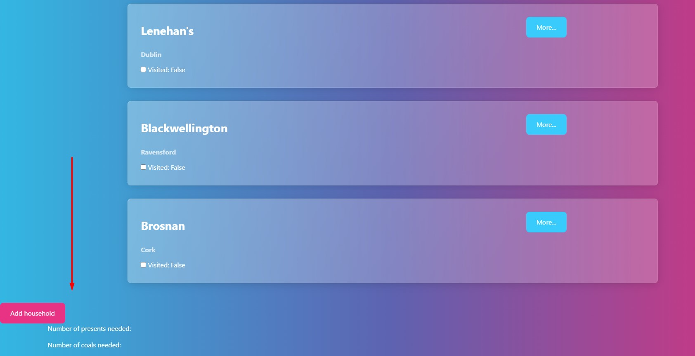

# Reindeer Radar App

Link to the deployed project: https://reindeer-radar-86c1994b9733.herokuapp.com/ 

This project was completed during the Hackathon 17-19 Dec at McKesson.
Made by William, Paddy, Taybe, Borys.

# Database Planning

The planned ERD for the project: 

# Purpose of this project
The app is designed to the user (Santa Claus), who can login to the account, create the list of naughty and nice kids, check the number of presents or coals, delivered to the kids. 
So, it's made on the model of a tracker/to-do list for the end user. The app solves the problem of making a proper and easy-to-use to-do list and having all the necessary things in one place for the proper tracking and control. 
 

# Target Audience
 This project is targeted for :
- Santa
- Santa’s Little Helpers
- Present thieves

# Wireframes
We used Balsamiq to create the wireframes. The final product looks a bit different from the original plans, although it was a great benefit to keep the project go properly and keep us on the track. The extended features may be implemened in the next sprints. 

# Agile methodology
Throughout this project, an Agile approach was taken in order to develop the app. User Stories have different acceptance criteria. The project board, as well as the User Stories can be found in the kanban board linked [here](<https://github.com/users/Will-WHyd/projects/5/views/1>). Kanban Board has these sections: No Status, ToDo, In Progress, Done. Using the Agile approach, with clear tasks and User stories helped a lot to complete the project successfully.

# Task Management
The Kanban board not only tracked user stories but also functioned as a detailed task list. We used that to break down user stories into smaller, actionable tasks, providing clear and manageable development objectives. This approach allowed us a better progress tracking and improved collaboration within the team.

# User experience /  User Stories
All the User Stories were mapped to the Kanban Board and you can see them here: 

- User Story#1 - Login and Logout #1 [UserStory1](<https://github.com/Will-WHyd/Reindeer-Radar/issues/1>)
- User Story#2 - Create lists #2  [UserStory2](<https://github.com/Will-WHyd/Reindeer-Radar/issues/2>)
- User Story#3 - Edit lists #3  [UserStory5](<https://github.com/Will-WHyd/Reindeer-Radar/issues/3>)
- (User Story): Festive visual theme #4  [UserStory4](<https://github.com/Will-WHyd/Reindeer-Radar/issues/4>)
- (User Story): Site Landing Page - UX/UI #5 [UserStory5](<(https://github.com/Will-WHyd/Reindeer-Radar/issues/5>)
- (User Story): Adding Kids #6   [UserStory6](<https://github.com/Will-WHyd/Reindeer-Radar/issues/6>)
- (User Story): Edit/Delete Kids #7 [UserStory7](<https://github.com/Will-WHyd/Reindeer-Radar/issues/7>)
- (User Story): Progess Bar #8  [UserStory8](<https://github.com/Will-WHyd/Reindeer-Radar/issues/8>)

### User Interface, Experience and Feedback
This section shows how the user interacts with the app. If the app is user-friendly and easy-to-navigate.

# Features 
The app consists of such pages: 
- Home 
- Login 
- Logout 
- Journey Planner
- The features to add, edit, delete the list of kids
- The total number of kids and households.

## Home
The main landing page

## Login page
Functionality for the user to login to the account

## Logout page
Delete an existing expense.
Functionality for the user to logout from the account

## Journey Planner 
The user can add the list of nice and naughty kids + household, related to the kids. 

## User-Friendly Interface
The UI is user-friendly and easy to navigate for the user. 
The user gets notification messages when he logs in / logs out

## Navbar 
The navigation bar with main buttons: Home, Login, Logout, Journey Planner

## Secure authentication
Robust authentication measures were taken place to safely store each users private data.
Every user needs to authenticate themselves and login to their account before accessing the features and data.
The authentication features include Register, Log in and Log out.

## Additional Security Features:
Users are redirected to the sign-in page if they attempt unauthorized actions. So unathorized users can not enter and manipulate other registered user's records. Unathorized users can not edit / delete the registered users' records, as such records are not visible for the unauthorized users. 

## Future features

Future features might include:

- Display on top: Count how many Naughty vs Nice in the household, and sum up how many presents vs coal is needed for the journey.
- Confirm if Households are visited (include an effect?)
- Filter households by City? (Filter by timezone?)
- Sound effects and jS elements.
- Styled buttons and images - snowflake or present images for buttons.
- Progress Bar – how many households are visited, how many are left.
- Santa in sleigh going across screen.
- Santa’s Playlist – link to spotify or youtube christmas playlist?
- Super optional – kids name randomizer to generate kids with one click?

# Technologies Used

- HTML 5
- CSS 3
- JavaScript
- Django
- Python
- Bootstrap 5 
- Balsamiq
- GitHub 
- Git 
- Heroku 

## Django Packages

- Gunicorn: As the server for Heroku
- Psycopg2: As an adaptor for Python and DB
- Crispy Forms: To style the forms

## Aditional Frameworks - Libraries - Programs to be Used

- PEP8: PEP8 to validate all the Python code
- W3C - HTML: W3C- HTML to validate all the HTML code
- W3C - CSS: W3C - CSS to validate the CSS code
- Google Chrome Dev Tools: To check App responsiveness and debugging

# Testing and Validation
## Responsiveness

We used the dev tools on chrome to test some of the functionality. 

# Testing and Validation
Due to the lack of time and some of the team members being absent, we didn't have much time to work on the HTML, CSS Validation, as well as reponsiveness on different screens. 
The plan is to work on the mentioned issues in the next sprints. 

## Python and Django
The lan is to work more with CI Python Linter to check the python scripts - in the next sprints. 

## Known Bugs 

- Currently there's a bug with a button shown at the bottom of the page, which we weren't able to fix, due to the lack of time. 
The plan is to work on fixing that in the next sprints.

# Deployment 

## Deployment Steps:

### Creating the Heroku App

- Begin by signing up or logging in to Heroku.
- In the Heroku Dashboard, click on 'New' and then select 'Create New App'.
- Choose a unique name for your project, like "Travel Buddies".
- Select the EU region.
- Click on "Create App".
- In the "Deploy" tab, choose GitHub as the deployment method.
- Connect your GitHub account and find/connect your GitHub repository.

#### Setting Up Environment Variables

- Create `env.py` in the top level of the Django app.
- Import `os` in `env.py`.
- Set up necessary environment variables in `env.py`, including the secret key and database URL.
- Update `settings.py` to use environment variables for secret key and database.
- Configure environment variables in the Heroku "Settings" tab under "Config Vars".
- Migrate the models to the new database connection in the terminal.
- Configure static files and templates directories in `settings.py`.
- Add Heroku to the `ALLOWED_HOSTS` list.

#### Creating Procfile and Pushing Changes

- Create a `Procfile` in the top level directory.
- Add the command to run the project in the `Procfile`.
- Add, commit, and push the changes to GitHub.

#### Heroku Deployment

- In Heroku, navigate to the Deployment tab and deploy the branch manually.
- Monitor the build logs for any errors.
- Upon successful deployment, Heroku will display a link to the live site.
- Make sure to resolve any deployment errors by adjusting the code as necessary.

### Forking the Repository

Forking the GitHub Repository allows you to create a copy of the original repository without affecting it. Follow these steps:

- Log in to GitHub or create an account.
- Visit the [repository link](https://github.com/Will-WHyd/Reindeer-Radar).
- Click on "Fork" at the top of the repository.

### Creating a Clone of the Repository

Creating a clone enables you to make a local copy of the repository. Follow these steps:

- Navigate to the [Project repository](https://github.com/Will-WHyd/Reindeer-Radar).
- Click on the <>Code button.
- Select the "HTTPS" option under the "Local" tab and copy the URL.
- Open your terminal and change the directory to your desired location.
- Use `git clone` followed by the copied repository URL.

# Resources

- [Code Institute Full Stack Development course materials](https://codeinstitute.net/) 
- [Bootstrap docs](https://getbootstrap.com/docs/5.0/getting-started/introduction/)
- [Stack overflow](https://stackoverflow.com/)

# Credits and Acknowledgements

- Great "thank you" to John Rearden - for the ideas, help with the errors fixing. 
- LMS for teaching content: (<https://learn.codeinstitute.net/ci_program/fsbootcamp_with_hackathons_v2_2>)
- Bootstrap technologies: (<https://getbootstrap.com/docs/4.0/components/card/>)
- ChatGPT was used to fix the errors in the code. 
- Photos were taken from: Pexels
- Audio downloaded from: https://pixabay.com/sound-effects/search/santa%20claus/?pagi=4 
