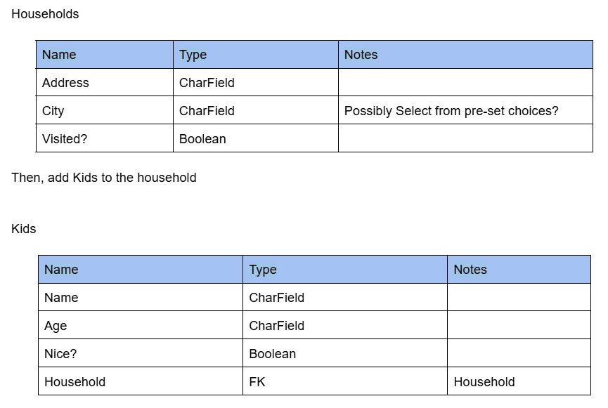

# Reindeer Radar App

Link to the deployed project: 

This project was completed during the Hackathon 17-19 Dec at McKesson.
Made by William, Taybe, Borys.

# Database Planning

The planned ERD for the project: 

# Purpose of this project

# Target Audience
 This project is targeted for :
- Santa
- Santa’s Little Helpers
- Present thieves

# Wireframes
We used Balsamiq to create the wireframes (<https://balsamiq.cloud/sfqofub/pgj5zvp/rAA7E>). The final product looks a bit different from the original plans, although it was a great benefit to keep the project go properly and keep us on the track. The extended features may be implemened in the next sprints. 

